# Lakehouse SQLPilot

**A governed control plane for production SQL in the Databricks Lakehouse**

## Overview

Lakehouse SQLPilot bridges the gap between exploratory data understanding (Genie) and production SQL execution (DBSQL) with enterprise governance. It transforms business intent into auditable, versioned, deterministic SQL execution.

**Supported Features:**
- ✅ Plan-based SQL generation (8 common patterns)
- ✅ Schema validation with JSON Schema
- ✅ Unity Catalog integration
- ✅ OAuth 2.0 service principal authentication
- ✅ Execution tracking and audit logs
- ✅ Web UI for plan creation and management
- ✅ AI-assisted plan generation
- ✅ SQL guardrails and safety checks
- ✅ Real-time execution monitoring
- ✅ Comprehensive test suite (416 tests passing!)

**Application Type:** Data Platform  
**Architecture:** React UI + FastAPI Backend + Lakebase Registry

---

## Why SQLPilot?

### The Challenge

Data teams struggle with the gap between exploratory data analysis and production SQL:
- **Manual SQL Writing** is error-prone and lacks standardization
- **Free-form SQL Execution** bypasses governance and audit requirements
- **Scattered Data Pipelines** make it hard to maintain consistency
- **Lack of Lineage** makes impact analysis difficult
- **No Version Control** for SQL transformations
- **Compliance Gaps** in data processing workflows

### The Solution: Governed SQL Control Plane

SQLPilot provides a structured, governed approach to production SQL:

**🔒 Enterprise Governance**
- Unity Catalog enforcement at all layers
- Complete audit trail of all SQL executions
- Permission validation before execution
- Automatic data lineage tracking

**📋 Plan-First Architecture**
- All SQL starts with a typed, versioned plan
- Schema validation prevents errors
- Pattern-based generation ensures consistency
- Deterministic: same plan + same data = same output

**🎯 Pattern Library**
- 8 production-ready patterns (SCD2, Incremental, Merge, etc.)
- Battle-tested SQL templates
- Optimized for Databricks lakehouse
- Extensible pattern system

**🤖 AI-Assisted (but Bounded)**
- Agents help create plans from business intent
- Validation and optimization suggestions
- **Agents NEVER execute SQL directly**
- Human approval required for all executions

**⚡ Production-Grade**
- OAuth service principal authentication
- Auto-refresh token management
- Retry logic and idempotency
- Real-time execution monitoring
- Comprehensive error handling

### Common Use Cases

**1. Incremental Data Loads**
```
Scenario: Daily customer events processing
Flow: Raw events → SQLPilot plan → DBSQL → Processed table
Benefit: Watermark-based incremental loads with automatic deduplication
```

**2. SCD Type 2 Dimension Management**
```
Scenario: Track customer profile changes over time
Flow: Customer updates → SCD2 plan → DBSQL → Historical dimension
Benefit: Automatic history tracking with valid_from/valid_to dates
```

**3. Data Quality & Governance**
```
Scenario: Ensure all transformations are audited
Flow: Data engineer → Create plan → Review → Execute → Audit log
Benefit: Complete lineage and compliance trail
```

**4. Cross-Team Collaboration**
```
Scenario: Standardize SQL patterns across teams
Flow: Shared plan library → Team adoption → Consistent execution
Benefit: Reduced errors, easier maintenance
```

**5. Production Pipelines**
```
Scenario: Schedule recurring data transformations
Flow: Validated plan → Scheduled execution → Monitor → Alert
Benefit: Reliable, repeatable data pipelines
```

### Architecture Pattern

> **📐 Interactive Diagram Available!**  
> Open [`docs/architecture.drawio`](docs/architecture.drawio) in [draw.io](https://app.diagrams.net) for an interactive, editable version of this architecture.

The architecture follows a **4-layer governed control plane pattern**:

#### **Layer 1: 👥 User Layer**
Business Analysts, Data Engineers, Data Stewards, and Platform Admins interact with SQLPilot through a unified interface.

#### **Layer 2: 🎛️ SQLPilot Control Plane**
- **React UI** (`ui/plan-editor/src/`) - Plan Editor, Plan List, Execution Dashboard
- **FastAPI Backend** (`api/main.py`) - REST API, SQL Compiler, Schema Validator, Execution Engine
- **AI Agents** (`agents/`) - Validation, Optimization, Explanation (bounded, no direct SQL execution)
- **Plan Registry (Lakebase)** - PostgreSQL-backed registry for versioned plans, execution history, metadata, and audit logs

#### **Layer 3: ⚡ Execution Plane**
- **Databricks SQL Warehouse** - Serverless compute for query execution with result caching
- **Execution Monitoring** - Real-time status tracking, error details, performance metrics

#### **Layer 4: 🔒 Governance & Data Layer**
- **Unity Catalog** - Centralized governance for catalogs, schemas, tables, and permissions
- **Data Lineage** - Column-level tracking, table dependencies, impact analysis
- **Audit Logs** - Complete compliance trail of all operations and user activity
- **Access Control** - Row-level security, column masking, permission validation
- **Delta Lake** - ACID transactions, time travel, schema evolution

#### **🔄 Supported Patterns (8 Total)**

| Pattern | Description | Use Case |
|---------|-------------|----------|
| 📊 **Incremental Append** | Watermark-based incremental loads | Daily event processing |
| 🔄 **Full Replace** | Complete table replacement | Dimension snapshots |
| 🔀 **Merge/Upsert** | Conditional insert/update | Customer master updates |
| 📜 **SCD Type 2** | Historical dimension tracking | Profile change history |
| 📸 **Snapshot** | Point-in-time data capture | Monthly data snapshots |
| 🎯 **Aggregate** | Pre-computed aggregations | Daily sales rollups |
| 🔑 **Surrogate Key** | Auto-generated surrogate keys | Dimension key generation |
| 🧹 **Deduplication** | Remove duplicate records | Data quality cleanup |

#### **Architecture Diagram**


> **📐 Interactive Diagram:**  
> Open [`docs/architecture.drawio`](docs/architecture.drawio) in [draw.io](https://app.diagrams.net) to edit this diagram.
>
> **🖼️ PNG Not Showing?**  
> The PNG needs to be exported from the draw.io file. See [`docs/EXPORT_PNG_GUIDE.md`](docs/EXPORT_PNG_GUIDE.md) for instructions.

```mermaid
graph TB
    subgraph users["👥 USER LAYER"]
        BA[Business Analysts]
        DE[Data Engineers]
        DS[Data Stewards]
        PA[Platform Admins]
    end
    
    subgraph control["🎛️ SQLPILOT CONTROL PLANE"]
        UI[📝 React UI<br/>Plan Editor • List • Dashboard]
        API[🔧 FastAPI Backend<br/>REST API • SQL Compiler]
        AGENTS[🤖 AI Agents<br/>Validation • Optimization]
        REGISTRY[(📋 Plan Registry<br/>Lakebase PostgreSQL)]
    end
    
    subgraph execution["⚡ EXECUTION PLANE"]
        WAREHOUSE[🏭 SQL Warehouse<br/>Serverless Compute]
        MONITOR[📊 Execution Monitor<br/>Status • Errors • Metrics]
    end
    
    subgraph governance["🔒 GOVERNANCE & DATA LAYER"]
        UC[🏛️ Unity Catalog<br/>Permissions • ACLs]
        LINEAGE[📈 Data Lineage]
        AUDIT[📝 Audit Logs]
        DELTA[💾 Delta Lake Tables]
    end
    
    users --> control
    control --> execution
    execution --> governance
    
    style users fill:#E3F2FD,stroke:#1976D2,stroke-width:3px
    style control fill:#F3E5F5,stroke:#7B1FA2,stroke-width:3px
    style execution fill:#FFF3E0,stroke:#E65100,stroke-width:3px
    style governance fill:#E8F5E9,stroke:#2E7D32,stroke-width:3px
```

<details>
<summary>📊 Click here for simplified Mermaid diagram (if PNG doesn't load)</summary>



</details>

### Benefits Summary

| Benefit | Description |
|---------|-------------|
| **Governed Execution** | Unity Catalog enforcement, automatic lineage, audit trails |
| **Deterministic** | Same plan + same data = same output, every time |
| **Pattern-Based** | Production-ready SQL templates, no manual SQL writing |
| **Version Control** | Plans are versioned, tracked, and auditable |
| **AI-Assisted** | Agents help create plans but never execute SQL |
| **Production-Ready** | OAuth, retries, monitoring, 416 tests passing |
| **Scalable** | Leverages Databricks SQL Warehouse serverless compute |
| **Safe** | Built-in guardrails prevent destructive operations |

---

## Prerequisites

Before using SQLPilot, you need:

1. **Databricks Workspace**: E2 or higher
2. **SQL Warehouse**: Serverless or Pro SQL Warehouse
3. **Unity Catalog**: Enabled on your workspace
4. **Service Principal**: For OAuth authentication (recommended)
5. **PostgreSQL Database**: For plan registry (Lakebase)

---

## Quick Start

### Installation

```bash
# Clone repository
git clone https://github.com/dey-abhishek/lakehouse-sqlpilot.git
cd lakehouse-sqlpilot

# Create virtual environment
python -m venv sqlpilot
source sqlpilot/bin/activate  # On Windows: sqlpilot\Scripts\activate

# Install dependencies
pip install -r requirements.txt
```

### Configuration

#### Required Parameters

| Parameter | Type | Description | Example |
|-----------|------|-------------|---------|
| `DATABRICKS_SERVER_HOSTNAME` | string | Your Databricks workspace URL | `e2-demo-field-eng.cloud.databricks.com` |
| `DATABRICKS_WAREHOUSE_ID` | string | SQL Warehouse ID for execution | `4b9b953939869799` |
| `DATABRICKS_CATALOG` | string | Unity Catalog name | `lakehouse-sqlpilot` |
| `DATABRICKS_SCHEMA` | string | Default schema name | `lakehouse-sqlpilot-schema` |
| `DATABRICKS_CLIENT_ID` | string | OAuth client ID (service principal) | `535493cf-ae57-4661-bfda-...` |
| `DATABRICKS_CLIENT_SECRET` | string | OAuth client secret | `your-secret-key` |

#### Configuration Example

Create a `.env` file in the project root:

```bash
# Databricks Workspace
DATABRICKS_SERVER_HOSTNAME=your-workspace.cloud.databricks.com
DATABRICKS_WAREHOUSE_ID=your-warehouse-id
DATABRICKS_CATALOG=lakehouse-sqlpilot
DATABRICKS_SCHEMA=lakehouse-sqlpilot-schema

# OAuth Authentication (Recommended)
DATABRICKS_CLIENT_ID=your-oauth-client-id
DATABRICKS_CLIENT_SECRET=your-oauth-client-secret

# Lakebase (Plan Registry)
LAKEBASE_HOST=your-postgres-host
LAKEBASE_PORT=5432
LAKEBASE_DATABASE=lakebase
LAKEBASE_USER=lakebase_user
LAKEBASE_PASSWORD=your-password
```

> **Security Note**: Never commit `.env` files to git. The file is already in `.gitignore`.

#### Obtaining Your Credentials

**1. Service Principal Setup:**
```bash
# Create service principal in Databricks
# Admin Console → Identity & Access → Service Principals → Add Service Principal

# Generate OAuth client secret
# Service Principal Details → Generate Secret

# Note the client ID and secret
```

**2. SQL Warehouse ID:**
```bash
# SQL → SQL Warehouses → Click your warehouse → Copy ID from URL
# URL format: /sql/warehouses/<warehouse-id>
```

**3. Unity Catalog:**
```bash
# Data → Unity Catalog → Your catalog → Verify it exists
# Create schema if needed:
# CREATE SCHEMA IF NOT EXISTS lakehouse-sqlpilot.lakehouse-sqlpilot-schema;
```

### Start the Application

#### Backend API

```bash
# Start FastAPI server
cd /path/to/lakehouse-sqlpilot
source sqlpilot/bin/activate
python -m uvicorn api.main:app --reload --host 0.0.0.0 --port 8001
```

**API will be available at:** `http://localhost:8001`

#### Frontend UI

```bash
# Start React development server
cd ui/plan-editor
npm install  # First time only
npm run dev
```

**UI will be available at:** `http://localhost:5173`

### Create Your First Plan

1. **Open the UI**: Navigate to `http://localhost:5173`
2. **Click "Create New Plan"**
3. **Fill in the form**:
   - Plan Name: `customer_events_incremental`
   - Description: `Daily customer events load`
   - Pattern: `Incremental Append`
   - Source Table: `raw_events`
   - Target Table: `processed_events`
   - Watermark Column: `event_timestamp`
4. **Preview SQL**: Click "Preview" to see generated SQL
5. **Save Plan**: Click "Save" to store in registry
6. **Execute**: Click "Execute" to run on SQL Warehouse

---

## Supported Patterns

### 1. 📊 Incremental Append
Append new rows based on watermark column.

```yaml
pattern:
  type: "INCREMENTAL_APPEND"
pattern_config:
  watermark_column: "event_timestamp"
  watermark_type: "timestamp"
```

**Use Case:** Daily event logs, transaction streams, sensor data

### 2. 🔄 Full Replace
Replace entire table atomically.

```yaml
pattern:
  type: "FULL_REPLACE"
target:
  write_mode: "overwrite"
```

**Use Case:** Dimension snapshots, reference data, small lookup tables

### 3. 🔀 Merge/Upsert
Update existing rows and insert new ones.

```yaml
pattern:
  type: "MERGE_UPSERT"
pattern_config:
  merge_keys: ["customer_id"]
  update_columns: ["name", "email", "updated_at"]
```

**Use Case:** Customer profiles, product catalogs, CDC pipelines

### 4. 📜 SCD Type 2
Track history with effective dates.

```yaml
pattern:
  type: "SCD2"
pattern_config:
  business_keys: ["customer_id"]
  effective_date_column: "valid_from"
  end_date_column: "valid_to"
  current_flag_column: "is_current"
  end_date_default: "9999-12-31 23:59:59"
  compare_columns: ["name", "email", "city"]
```

**Use Case:** Customer dimensions, employee history, product changes

### 5. 📸 Snapshot
Point-in-time snapshots with partitioning.

```yaml
pattern:
  type: "SNAPSHOT"
pattern_config:
  snapshot_column: "snapshot_date"
  snapshot_value: "${execution_date}"
```

**Use Case:** Daily snapshots, inventory levels, balance sheets

### 6-8. Additional Patterns
- **Aggregate Refresh**: Materialized aggregations
- **Surrogate Key Generation**: Auto-generate surrogate keys
- **Deduplication**: Remove duplicate records

See [Pattern Documentation](docs/patterns.md) for details.

---

## Project Structure

```
lakehouse-sqlpilot/
│
├── 📋 plan-schema/              # Schema Definition & Validation
│   └── v1/
│       └── plan.schema.json     # JSON Schema for plan validation
│
├── 📦 plan_schema/              # Python Validation Package
│   └── v1/
│       └── validator.py         # Active validator implementation
│
├── 🔧 compiler/                 # SQL Compilation Engine
│   ├── patterns/                # Pattern implementations
│   │   ├── scd2.py             # SCD Type 2
│   │   ├── incremental_append.py
│   │   ├── merge_upsert.py
│   │   └── full_replace.py
│   ├── sql_generator.py         # SQL generation orchestrator
│   └── guardrails.py            # SQL safety checks
│
├── ⚡ execution/                # Execution Engine
│   ├── executor.py              # SQL execution manager
│   ├── tracker.py               # Execution tracking
│   └── retry_handler.py         # Retry logic & idempotency
│
├── 🤖 agents/                   # AI Assistance Layer
│   ├── plan_suggestion_agent.py # Suggest plans from intent
│   ├── explanation_agent.py     # Explain plan behavior
│   ├── validation_agent.py      # Validate plan correctness
│   └── optimization_agent.py    # Performance recommendations
│
├── 🏛️  unity_catalog/          # Unity Catalog Integration
│   ├── permissions.py           # Permission validation
│   └── lineage.py              # Lineage tracking
│
├── 🌐 api/                      # REST API Layer
│   └── main.py                  # FastAPI application
│       ├── /api/v1/plans        # Plan management endpoints
│       ├── /api/v1/executions   # Execution endpoints
│       └── /api/v1/preview      # Preview/validation endpoints
│
├── 🎨 ui/                       # Web UI
│   └── plan-editor/             # React + TypeScript UI
│       ├── src/pages/           # Plan editor, list, dashboard
│       ├── src/components/      # Reusable UI components
│       └── src/services/        # API integration
│
├── 🔐 infrastructure/           # Infrastructure & Auth
│   ├── oauth_token_manager.py   # OAuth 2.0 token management
│   ├── databricks_client.py     # Databricks API wrapper
│   └── lakebase_backend.py      # PostgreSQL plan registry
│
├── 📊 plan_registry/            # Plan Storage
│   └── plan_storage.py          # Plan versioning & retrieval
│
├── 🧪 tests/                    # Comprehensive Test Suite
│   ├── test_uat_end_to_end.py  # UAT tests (8/10 passing)
│   ├── test_api_execution.py   # API integration tests
│   ├── test_compiler.py         # Pattern generation tests
│   └── integration/             # End-to-end integration tests
│
└── 📚 docs/                     # Documentation
    ├── patterns.md              # Pattern documentation
    ├── OAUTH_AUTHENTICATION.md  # OAuth setup guide
    └── TESTING_QUICKSTART.md    # Testing guide
```

---

## API Reference

### Plans API

| Endpoint | Method | Description |
|----------|--------|-------------|
| `/api/v1/plans` | POST | Create a new plan |
| `/api/v1/plans` | GET | List all plans |
| `/api/v1/plans/{id}` | GET | Get plan details |
| `/api/v1/plans/{id}` | PUT | Update plan |
| `/api/v1/plans/{id}` | DELETE | Delete plan |
| `/api/v1/plans/validate` | POST | Validate plan without saving |
| `/api/v1/plans/compile` | POST | Compile plan to SQL |

### Executions API

| Endpoint | Method | Description |
|----------|--------|-------------|
| `/api/v1/execute` | POST | Execute a plan |
| `/api/v1/executions` | GET | List executions |
| `/api/v1/executions/{id}` | GET | Get execution details |
| `/api/v1/executions/{id}/status` | GET | Get execution status |

### Example: Create and Execute Plan

```bash
# Create plan
curl -X POST http://localhost:8001/api/v1/plans \
  -H "Content-Type: application/json" \
  -d '{
    "plan": {
      "schema_version": "1.0",
      "plan_metadata": {
        "plan_name": "customer_incremental",
        "description": "Daily customer load",
        "owner": "data-eng@company.com"
      },
      "pattern": {"type": "INCREMENTAL_APPEND"},
      "source": {
        "catalog": "main",
        "schema": "raw",
        "table": "customers"
      },
      "target": {
        "catalog": "main",
        "schema": "processed",
        "table": "customers"
      },
      "pattern_config": {
        "watermark_column": "updated_at"
      },
      "execution_config": {
        "warehouse_id": "your-warehouse-id"
      }
    }
  }'

# Execute plan
curl -X POST http://localhost:8001/api/v1/execute \
  -H "Content-Type: application/json" \
  -d '{
    "plan_id": "plan-id-from-above",
    "warehouse_id": "your-warehouse-id"
  }'
```

---

## Testing

### Test Coverage

**Total Tests:** 423  
**Passing:** 416 (98.3%)  
**Skipped:** 7 (intentional - performance/manual tests)  
**Failing:** 0

### Run Tests

```bash
# All tests
source sqlpilot/bin/activate
python -m pytest tests/ -v

# Unit tests only
python -m pytest tests/ -v -m "not requires_databricks"

# Integration tests (requires Databricks)
python -m pytest tests/ -v -m requires_databricks

# UAT end-to-end tests
python -m pytest tests/test_uat_end_to_end.py -v
```

### Test Categories

- ✅ **Unit Tests**: Plan validation, pattern generation, compiler
- ✅ **Integration Tests**: API endpoints, database operations
- ✅ **UAT Tests**: End-to-end workflows with live Databricks
- ✅ **Security Tests**: SQL injection prevention, permission checks
- ✅ **Frontend Tests**: React components, E2E workflows

---

## Performance Considerations

### Best Practices

1. **Use Appropriate Warehouse Size**:
   - Small plans: X-Small or Small warehouse
   - Large data volumes: Medium or Large warehouse
   - Complex SCD2: Large or X-Large warehouse

2. **Optimize Watermark Queries**:
   - Index watermark columns
   - Use partition pruning
   - Avoid full table scans

3. **Plan Execution Frequency**:
   - High-frequency: Consider streaming alternatives
   - Batch processing: Schedule during off-peak hours
   - Monitor execution times and adjust accordingly

4. **Error Handling**:
   - Plans automatically retry on transient failures
   - Configure `max_retries` in execution config
   - Monitor execution dashboard for failures

### Expected Performance

- **Plan Validation**: < 1 second
- **SQL Generation**: < 2 seconds
- **Execution Time**: Varies by data volume
  - Small tables (< 1K rows): < 10 seconds
  - Medium tables (1K-1M rows): 30 seconds - 5 minutes
  - Large tables (> 1M rows): 5+ minutes

---

## Troubleshooting

### Common Issues

#### 1. Authentication Errors

**Error**: `401 Unauthorized` or `OAuth token expired`

**Solution**:
- Verify OAuth client ID and secret are correct
- Check service principal has SQL Warehouse access
- Ensure token auto-refresh is working
- Review logs: `infrastructure/oauth_token_manager.py`

#### 2. Permission Denied

**Error**: `403 Forbidden` or `Permission denied on table`

**Solution**:
- Grant service principal SELECT on source tables
- Grant CREATE/INSERT on target tables
- Verify Unity Catalog permissions
- Check warehouse access grants

#### 3. Table Not Found

**Error**: `TABLE_OR_VIEW_NOT_FOUND`

**Solution**:
- Verify catalog.schema.table names are correct
- Check table exists in Unity Catalog
- Ensure service principal can see the catalog
- Use three-part names: `catalog.schema.table`

#### 4. SQL Compilation Errors

**Error**: `Plan validation failed` or `Pattern config invalid`

**Solution**:
- Validate plan schema against `plan.schema.json`
- Check pattern_config has all required fields
- Review error messages in validation response
- Test with example plans in `examples/`

#### 5. Execution Timeout

**Error**: `Statement execution timeout`

**Solution**:
- Increase `timeout_seconds` in execution_config
- Use larger SQL Warehouse
- Optimize query with partition pruning
- Check for data skew

#### 6. Frontend Not Loading

**Error**: Blank page or `Failed to fetch`

**Solution**:
- Verify backend is running: `curl http://localhost:8001/health`
- Check CORS settings in `api/main.py`
- Clear browser cache
- Check browser console for errors

---

## Security Notes

### Authentication

- **OAuth Service Principal** (recommended): Machine-to-machine authentication
- **Personal Access Token**: For development/testing only
- **Never commit credentials**: Use `.env` files (gitignored)
- **Rotate secrets regularly**: Generate new OAuth secrets quarterly

### Authorization

- **Unity Catalog Integration**: All permissions enforced
- **Least Privilege**: Grant minimum required permissions
- **Audit Trails**: All operations logged in execution history
- **Row/Column Security**: Enforced by Unity Catalog

### SQL Safety

**SQLPilot BLOCKS:**
- `DROP TABLE`/`DROP DATABASE`
- `TRUNCATE` operations
- `DELETE` without `WHERE` clause
- `ALTER` with breaking changes
- Cross-catalog writes (if not allowed)

**SQLPilot ALLOWS:**
- `SELECT`, `INSERT`, `MERGE`
- `CREATE OR REPLACE TABLE`
- Window functions and aggregations
- Common table expressions (CTEs)

### Data Protection

- **No Free-form SQL**: All SQL generated from patterns
- **Schema Validation**: Plans validated before execution
- **Preview Mode**: Test SQL without executing
- **Rollback Support**: Use Delta Lake time travel if needed

---

## Governance & Compliance

### Audit Trails

Every execution is tracked with:
- **Execution ID**: Unique identifier
- **Plan Version**: Which plan was executed
- **User**: Who initiated execution
- **Timestamp**: When it ran
- **SQL**: Exact SQL that was executed
- **Status**: Success/failure
- **Error Details**: If failed, complete error trace
- **Rows Affected**: Number of rows modified

### Data Lineage

Automatic lineage tracking via Unity Catalog:
- **Column-level lineage**: Track data flow from source to target
- **Table dependencies**: See which tables depend on each other
- **Impact analysis**: Understand downstream effects of changes
- **Compliance reporting**: Generate audit reports

### Access Control

- **Unity Catalog Enforced**: All table permissions respected
- **Service Principal Auth**: No user credentials in code
- **Role-Based Access**: Plans can have owner/viewer roles
- **Execution Approval**: Optional approval workflows

---

## Agent System

SQLPilot includes 4 strictly bounded AI agents:

### 1. 🤖 Plan Suggestion Agent
- **Purpose**: Help create plans from business intent
- **Input**: Natural language description
- **Output**: Suggested plan structure
- **Cannot**: Execute SQL or modify tables

### 2. 📖 Explanation Agent
- **Purpose**: Explain what a plan will do
- **Input**: Plan specification
- **Output**: Human-readable explanation
- **Cannot**: Change plan or execute anything

### 3. ✅ Validation Agent
- **Purpose**: Validate plan correctness
- **Input**: Plan to validate
- **Output**: Validation errors and warnings
- **Cannot**: Auto-fix issues or execute

### 4. ⚡ Optimization Agent
- **Purpose**: Suggest performance improvements
- **Input**: Plan and execution history
- **Output**: Optimization recommendations
- **Cannot**: Apply changes automatically

**ALL agents are FORBIDDEN from:**
- Executing SQL
- Modifying tables
- Bypassing validation
- Auto-deploying to production

---

## Genie ↔ SQLPilot Handoff

### Clear Boundaries

**Genie's Role** (Exploration):
- Understanding data structure
- Exploratory queries
- Sample data validation
- Ad-hoc analysis

**SQLPilot's Role** (Production):
- Accept validated table references
- Create versioned plans
- Generate deterministic SQL
- Execute with governance

**Boundary**: Genie CANNOT create plans. SQLPilot CANNOT answer exploratory questions.

### Integration Pattern

```
1. User explores with Genie
   └─> "Show me schema of customers table"
   └─> "What are the latest 10 rows?"
   
2. User creates plan in SQLPilot
   └─> Use table reference from Genie
   └─> Define pattern and config
   └─> Preview generated SQL
   
3. SQLPilot executes with governance
   └─> Validate permissions
   └─> Execute on SQL Warehouse
   └─> Track lineage and audit
```

---

## Support & Resources

- **Documentation**: [docs/](docs/)
- **GitHub Issues**: [github.com/dey-abhishek/lakehouse-sqlpilot/issues](https://github.com/dey-abhishek/lakehouse-sqlpilot/issues)
- **Pattern Examples**: [examples/](examples/)
- **Test Suite**: [tests/](tests/)
- **OAuth Setup**: [OAUTH_AUTHENTICATION.md](OAUTH_AUTHENTICATION.md)
- **Testing Guide**: [TESTING_QUICKSTART.md](TESTING_QUICKSTART.md)

---

## Version History

- **v1.0** (Current): Production release
  - 8 SQL patterns (SCD2, Incremental, Merge, etc.)
  - Web UI for plan management
  - OAuth service principal authentication
  - Plan registry with versioning
  - Real-time execution monitoring
  - 416 tests passing
  - Unity Catalog integration
  - AI agents (suggestion, validation, optimization)

---

## Contributing

See [CONTRIBUTING.md](CONTRIBUTING.md) for guidelines.

---

## License

This project is licensed under the Databricks License. See the [LICENSE](LICENSE) file for details.

Copyright 2026 Databricks, Inc.

---

## What SQLPilot IS and IS NOT

### What SQLPilot IS ✅

- A governed control plane for production SQL
- A system that turns business intent into durable, auditable SQL execution
- A bridge between exploration (Genie) and production execution (DBSQL)
- A pattern library for common SQL transformations
- An enterprise-grade data pipeline orchestrator

### What SQLPilot IS NOT ❌

- NOT a SQL generator (it's a governance layer)
- NOT a chatbot (it's a structured system)
- NOT a BI tool (it's for data engineering)
- NOT a replacement for Databricks Genie or AI Assistant
- NOT free-form SQL execution (all SQL is pattern-based)

---

**Built with ❤️ for the Databricks Data Intelligence Platform**

> 🚀 Ready to get started? Follow the [Quick Start](#quick-start) guide above!
